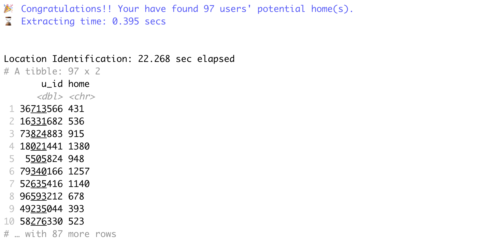
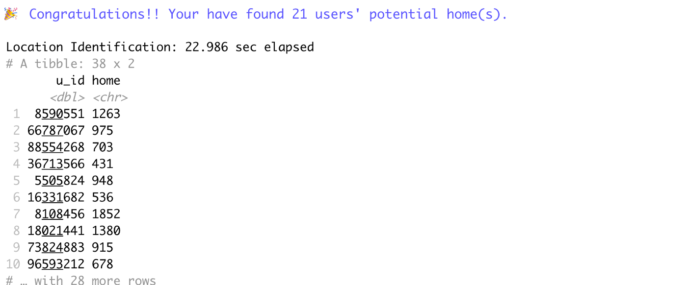

# homelocator

## Overview

The goal of `homelocator` is to provide a consistent framework and
interface for the adoption of different approaches for identifying
meaningful locations for users. With the package, you are able to write
structured, algorithmic ‘recipes’ to identify meaningful locations
according to your research requirements. The package also has a number
of built-in ‘recipes’ that have been translated from approaches in the
existing literature. A walkthrough demo video can be found in
`demo.mov`. And a static website of `homelocator` package can be found
in `docs`.

## Download open-sources

Download `homelocator` open-sources from *figshare* at:
<https://figshare.com/s/ce7b8bcfd2e6b44a5568>

## Installation

Install the released version of `homelocator` as follows, where the
**homelocator\_0.1.0.tar.gz** is stored under
`homelocator-open-sources/homelocator-package/`.

``` r
remotes::install_local("~/Downloads/homelocator-open-sources/homelocator-package/homelocator_0.1.0.tar.gz", dependencies = T)
```

## Example

These are some basic examples that show you how to use common functions
in the package.

### Validate input dataset

You need to make sure the input dataset includes three essential
attributes:

  - a unique identifier for the person or user
  - a unique identifier for the spatial location for the data point
  - a timestamp that reflects the time the data point was created

You can use `validate_dataset()` to validate your input dataset before
starting identifying meaningful locations. In this function, you need to
specify the names of three essential attribute that used in your
dataset.

``` r
# Load homelocator library
library(homelocator)
#> Welcome to homelocator package!
```

``` r
# Load other needed libraries
library(tidyverse)
library(here)
```

``` r
# load test sample dataset 
data("test_sample", package = "homelocator")
df_validated <- validate_dataset(test_sample, user = "u_id", timestamp = "created_at", location = "grid_id")
#> 🎉 Congratulations!! Your dataset has passed validation.
#> 👤 There are 100 unique users in your dataset.
#> 🌏 Now start your journey identifying their meaningful location(s)!
#> 👏 Good luck!
#> 
head(df_validated)
#> # A tibble: 6 x 3
#>       u_id grid_id created_at         
#>      <dbl> <chr>   <dttm>             
#> 1  8590551 561     2014-08-17 15:41:06
#> 2 66787067 975     2013-02-05 00:55:08
#> 3 88554268 480     2012-12-24 01:05:46
#> 4 21880033 364     2013-01-04 22:35:24
#> 5 36713566 431     2012-09-10 04:38:51
#> 6 25782489 365     2014-11-19 23:27:25
```

### Nesting users for parallel computing

To speed up computing progress, you can nest the validated dataset by
user so that the subsequent location inference can be applied to each
user at the same time.

``` r
df_nested <- nest_verbose(df_validated, c("created_at", "grid_id"))
#> 🛠 Start nesting...
#> ✅ Finish nesting!
#> ⌛ Nesting time: 0.054 secs
#> 
head(df_nested)
#> # A tibble: 6 x 2
#>       u_id data                
#>      <dbl> <list>              
#> 1  8590551 <tibble [177 × 2]>  
#> 2 66787067 <tibble [441 × 2]>  
#> 3 88554268 <tibble [312 × 2]>  
#> 4 21880033 <tibble [102 × 2]>  
#> 5 36713566 <tibble [1,629 × 2]>
#> 6 25782489 <tibble [24 × 2]>
head(df_nested$data[[1]])
#> # A tibble: 6 x 2
#>   created_at          grid_id
#>   <dttm>              <chr>  
#> 1 2014-08-17 15:41:06 561    
#> 2 2015-02-24 20:05:49 1141   
#> 3 2015-03-05 23:57:26 1140   
#> 4 2015-02-15 18:41:21 1264   
#> 5 2015-02-23 07:01:17 1264   
#> 6 2015-04-02 09:32:49 1263
```

### Enrich variables from timestamp

Add additional needed varialbes derived from the timestamp column. These
are often used/needed as intermediate variables in home location
algorithms, such as year, month, day, day of the week and hour of the
day, etc.

``` r
df_enriched <- enrich_timestamp(df_nested, timestamp = "created_at")
#> 🛠 Enriching variables from timestamp...
#> 
#> ✅ Finish enriching! New added variables: year, month, day, wday, hour, ymd.
#> ⌛ Enriching time: 0.568 secs
#> 
head(df_enriched$data[[1]])
#> # A tibble: 6 x 8
#>   created_at          grid_id  year month   day  wday  hour ymd       
#>   <dttm>              <chr>   <dbl> <dbl> <int> <dbl> <int> <date>    
#> 1 2014-08-17 15:41:06 561      2014     8    17     1    15 2014-08-17
#> 2 2015-02-24 20:05:49 1141     2015     2    24     3    20 2015-02-25
#> 3 2015-03-05 23:57:26 1140     2015     3     5     5    23 2015-03-06
#> 4 2015-02-15 18:41:21 1264     2015     2    15     1    18 2015-02-16
#> 5 2015-02-23 07:01:17 1264     2015     2    23     2     7 2015-02-23
#> 6 2015-04-02 09:32:49 1263     2015     4     2     5     9 2015-04-02
```

### Use built-in recipes

Current available recipes, where `HMLC` is the default recipe used in
`identify_location`:

  - `HMLC`:
      - Weighs data points across multiple time frames to ‘score’
        potentially meaningful locations for each user
  - `FREQ`
      - Selects the most frequently ‘visited’ location assuming a user
        is active mainly around their home location.
  - `OSNA`: [Efstathiades et
    al.2015](https://www.researchgate.net/publication/279884727_Identification_of_Key_Locations_based_on_Online_Social_Network_Activity)
      - Finds the most ‘popular’ location during ‘rest’, ‘active’ and
        ‘leisure time. Here we focus on ’rest’ and ‘leisure’ time to
        find the most possible home location for each user.
  - `APDM`: [Ahas et
    al. 2010](https://www.researchgate.net/publication/233197970_Using_Mobile_Positioning_Data_to_Model_Locations_Meaningful_to_Users_of_Mobile_Phones)
      - Calculates the average and standard deviation of start time data
        points by a single user, in a single location.

#### HMLC

``` r
# default recipe: homelocator -- HMLC
identify_location(test_sample, user = "u_id", timestamp = "created_at", location = "grid_id", show_n_loc = 1, recipe = "HMLC")
```

 \#\#\#\# FREQ

``` r
# recipe: Frequency -- FREQ
identify_location(test_sample, user = "u_id", timestamp = "created_at", location = "grid_id", 
                  show_n_loc = 1, recipe = "FREQ")
```


#### OSNA

``` r
# recipe: Online Social Network Activity -- OSNA
identify_location(test_sample, user = "u_id", timestamp = "created_at", location = "grid_id", 
                  show_n_loc = 1, recipe = "OSNA")
```



#### APDM

``` r
# recipe: Online Social Network Activity -- APDM
## APDM recipe strictly returns the most likely home location
## It is important to create your location neighbors table before you use the recipe!!
## example: st_queen <- function(a, b = a) st_relate(a, b, pattern = "F***T****")
##          neighbors <- st_queen(df_sf) ===> convert result to dataframe 
data("df_neighbors", package = "homelocator")
identify_location(test_sample, user = "u_id", timestamp = "created_at", location = "grid_id", 
                  show_n_loc = 1, recipe = "APDM")
```


